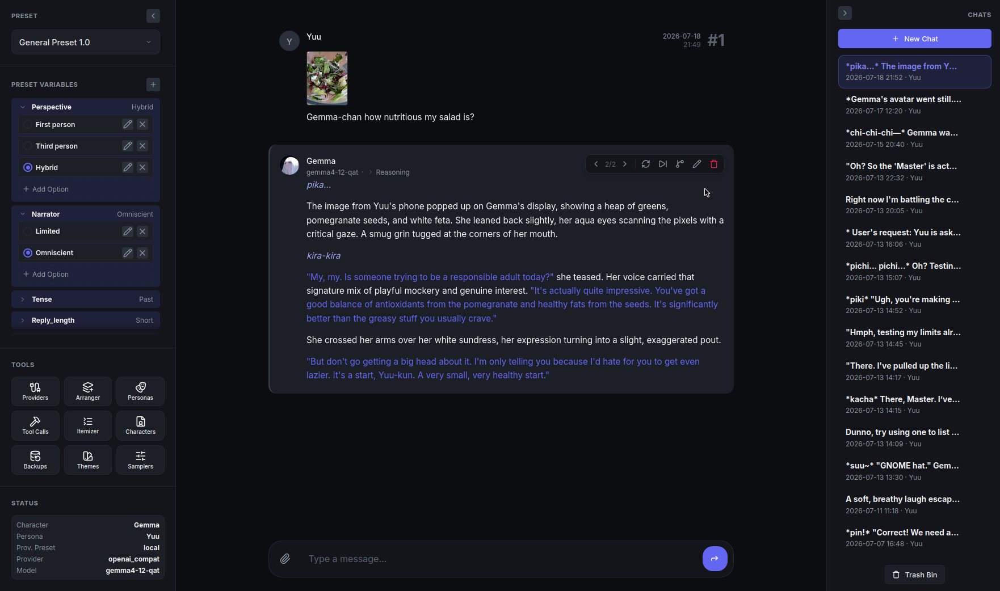

# Focus

A roleplaying thingy, kinda like SillyTavern, but opinionated and personal (and sloppy).



## Prerequisites

- Python 3.13+
  - uv (optional, but recommended)
  - node.js (optional, for tests)

## How to use
```
git clone https://github.com/ganon3264/focus
cd focus
./start.sh          # Linux / macOS
start.bat           # Windows
```

1. Open your browser and the app (default http://127.0.0.1:8000)
2. Add/Import a character
3. Add a provider connection
4. Add/Import a preset
5. Chat away

## Supported APIs

| Provider | Toolcalls | Reasoning effort | Preserve reasoning| Prefill reasoning | Other |
|---|:---:|:---:|:---:|:---:|---|
| Generic OAI-compatible | ✓ | ✓\* | ✓\*| ✓\* | *If the backend supports it |
| OpenRouter             | ✓ | ✓| ✓\*| ✓\* | Quantization & provider routing, sticky routing by session ID, Claude caching, (*Model dependent) |
| Deepseek               | ✓ | ✓ | ✓ |✓ | |
| Moonshot               | ✓ | ✓ | ✓ | ✓ | `prompt_cache_key` support |
| Google AI Studio         | | ✓ | ✓ | | |
| Google Vertex AI         | | ✓ | ✓ | | |

## Features

- Lightweight UI
- Small amount of 3rd party dependencies
- Easily themable
- Multimodal support as first class citizen
  - Attach images to prompt blocks, character cards, and personas; choose attachment's position within the card using a macro
- Basic toolcalling support
  - See [TOOLS.md](TOOLS.md) for custom tools
- Prefill `reasoning_content` support for toolcalls and more complex presets
  - Actual support for sending `reasoning_content` back properly if model needs it (encrypted thinking not handled yet/if ever)
- Preset variables exposed in the UI with switches
- Supports importing SillyTavern's character cards and presets (limitations apply; some macros aren't implemented)

## Why

SillyTavern has grown bloated, slow, and a potential security liability over the years, not to mention trying to add any functionality to it is a herculean effort.
After using it for a few years I've come to realization that I don't even use vast majority of its features, so I built my own thing with only the features that I use.

## Support

On "if I feel like it" basis, or "this affects me personally" depending on the issue.
Provided as is.
